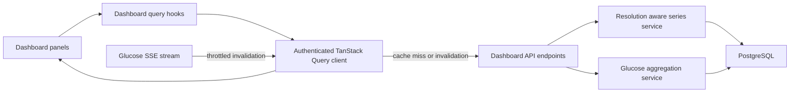

# Dashboard performance architecture

The dashboard has a layered performance design. It avoids unnecessary browser requests and rendering, shapes timeline data for the available chart width, and calculates clinical summaries from complete data in PostgreSQL.

This guide is the source of truth for that design.

## Architecture

Each layer has a separate responsibility:

* **TanStack Query** reuses data inside one authenticated browser session, deduplicates consumers with the same key, and controls refresh behavior.
* **Dashboard query hooks** define request ownership, cache keys, freshness, transition states, and targeted invalidation.
* **The glucose series API** limits timeline data to the amount the chart can display while preserving important excursions and true sensor gaps.
* **PostgreSQL aggregation** calculates CGM statistics, time in range, comparison data, and AGP percentiles from complete eligible readings.
* **Chart composition** mounts only the active responsive chart and defers AGP until it approaches the viewport.

Redis is not part of this architecture. PostgreSQL remains the source of truth.

## Main implementation locations

* `apps/web/src/compositions/AppShell/AppShell.tsx` mounts the authenticated query provider and shared dashboard range provider.
* `apps/web/src/providers/AuthenticatedQueryProvider.tsx` owns the in memory `QueryClient` and clears it when the authenticated user changes.
* `apps/web/src/lib/query/dashboard.ts` owns dashboard resources, user scoped query keys, freshness constants, retry rules, and invalidation helpers.
* `apps/web/src/hooks/dashboard-query/dashboard-query-hooks.ts` owns the standard dashboard read hooks.
* `apps/web/src/hooks/dashboard-query/use-dashboard-glucose-series.ts` owns resolution aware series fetching and cache coverage reuse.
* `apps/web/src/hooks/dashboard-query/use-dashboard-invalidation.ts` exposes resource scoped and complete dashboard invalidation.
* `apps/web/src/compositions/DashboardChartPanels/DashboardChartPanels.tsx` owns the shared timeline queries and deferred AGP mount.
* `apps/web/src/components/DashboardTimelineChart/DashboardTimelineChart.tsx` selects one responsive chart runtime after hydration.
* `apps/web/src/lib/glucose/series-resolution.ts` owns point budgets, coverage checks, sufficiency checks, and local derivation from cached series.
* `apps/api/src/routers/integrations.py` publishes the optimized series, AGP percentile, and dashboard summary endpoints.
* `apps/api/src/services/glucose_series.py` performs bounded raw or reduced timeline selection.
* `apps/api/src/services/glucose_aggregation.py` performs complete dataset summary and AGP calculations in PostgreSQL.

## Browser cache and query ownership

`AuthenticatedQueryProvider` creates one `QueryClient` for the lifetime of the authenticated application shell. Navigating away from the dashboard does not destroy that client. Returning within the retention window can therefore display recently loaded data without repeating fresh reads.

The cache is memory only. Health data is not written to local storage, session storage, IndexedDB, or another durable browser store.

Every dashboard query key begins with `dashboard` and the authenticated user ID. Detailed keys then include the resource and every request input currently supported by that hook, such as:

* Raw or absolute time range
* Time zone
* Source selection marker
* Period, limit, and offset where applicable
* Timeline point budget

Relative ranges retain expressions such as `now-24h` and `now` in the key. Selecting the same relative range again can reuse its cache entry. Absolute and zoomed windows use their exact timestamps and remain isolated.

The provider clears the complete cache when the authenticated user changes. The sign out action also clears it before redirecting to login. This prevents cached health data from crossing user boundaries.

The detailed freshness and retention policies live in [Dashboard query cache](dashboard-query-cache.md).

## Loading, updating, and failures

Dashboard query hooks distinguish between the first load and later background work:

* `isLoading` means no successful data is available yet.
* `isUpdating` means existing data remains visible while a request is running.
* `isPreviousData` means a parameter change is temporarily showing the prior successful result.
* `hasBackgroundError` means a refresh failed but valid prior data is still displayed.

Historical queries use previous data as a placeholder during range changes. A user does not see a completed panel replaced by an empty loading state just because a new range or refresh is in progress.

The dashboard query functions intentionally do not consume TanStack Query cancellation signals. In Next development Strict Mode, consuming the signal cancelled the first mounted request and caused the remount to issue the same request again. Range specific query keys keep late responses isolated from the active range, so an old result cannot replace the newly selected range.

## Shared timeline data and responsive rendering

`DashboardChartPanels` owns one glucose series result, one bolus result, and one pump event result for the committed dashboard window. It passes those results into the active timeline presentation. Responsive chart variants do not own separate queries.

`DashboardTimelineChart` selects exactly one runtime after the browser breakpoint is known:

1. Below 768 pixels, the mobile merged chart mounts.
2. From 768 through 1023 pixels, the desktop merged chart mounts.
3. From 1024 pixels, the desktop timeline chart mounts.

The server render shows a stable loading shell. Hidden mobile and desktop chart runtimes are not mounted behind CSS, which avoids duplicate chart initialization and repeated transformations.

The AGP panel is also deferred. An `IntersectionObserver` mounts it when the panel enters a 200 pixel margin around the viewport. This keeps its percentile request and chart runtime out of the initial visible dashboard work.

## Resolution aware glucose timeline

The timeline calls `GET /api/integrations/glucose/series` with:

* `start`, the exact inclusive start time
* `end`, the exact exclusive end time
* `maxDataPoints`, the maximum readings the chart can use
* `include_secondary`, whether secondary CGM sources are eligible

The browser measures the chart plot width and uses the integer CSS pixel width as the point budget, clamped to the supported range of 4 through 2,000 points. A resize request is delayed by 150 milliseconds. Growth must exceed 16 pixels before it can require more data. Shrinking the chart reuses the existing response.

The server chooses one of two response modes:

* **Raw mode** returns every eligible reading when the readings fit within the point budget.
* **Reduced mode** groups the exact window into deterministic time buckets and selects the first, last, minimum, and maximum candidates. The final response cannot exceed the requested point budget.

Selecting the minimum and maximum candidates preserves important high and low excursions that a simple average could hide. Returned readings remain in chronological order.

The response includes the applied window, raw reading count, returned point count, reduction mode, bucket interval, source selection, timeline revision, and continuity gaps. Continuity is calculated from raw readings before reduction, so a reduced series can still render real sensor gaps correctly.

### Cache coverage reuse

Before requesting a series, `useDashboardGlucoseSeries` searches fresh user scoped series entries. It can slice a covering cached window locally when that data has enough resolution for the target window.

If cached coverage is usable but stale or not detailed enough, it may remain visible as placeholder data while the required response loads. Raw data can satisfy any narrower covered range. Reduced data is reused only when its bucket interval is sufficient for the new range and point budget.

For relative live ranges, the hook tolerates a cached tail that is within the historical freshness window, then refreshes it on mount. Absolute ranges do not use that live tail tolerance.

Reduced timeline data is for drawing the timeline only. It must never be used to calculate AGP percentiles, CGM statistics, time in range, or other clinical summaries.

## Complete server aggregation

The dashboard uses separate derived data endpoints because accurate summaries require every eligible reading even when the timeline is reduced.

### Dashboard glucose summary

`GET /api/integrations/glucose/dashboard-summary` accepts an exact window, IANA time zone, and source selection. PostgreSQL scans the current window and its immediately preceding comparison window in one statement.

The response contains:

* Mean, standard deviation, minimum, maximum, coefficient of variation, GMI, active percentage, and reading count
* Detailed current time in range buckets
* Previous period time in range buckets when enough comparison readings exist
* The applied windows, source selection, target range snapshot, and opaque calculation revisions

The endpoint returns one coherent server snapshot for the statistics and time in range panels.

### AGP percentiles

`GET /api/integrations/glucose/percentiles` accepts an exact dashboard window and IANA time zone. PostgreSQL groups complete eligible readings by local hour and calculates the 10th, 25th, 50th, 75th, and 90th percentiles without a row cap.

The response includes all 24 hourly buckets, reading count, source selection, target range snapshot, applied window, time zone, and calculation revisions. Missing hours are represented as empty buckets rather than fabricated values.

AGP curve smoothing happens only after these exact hourly anchors are returned. It does not change the percentile values and must not introduce overshoot or percentile crossing.

## Refresh and invalidation

Successful mutations invalidate only the resource families affected by the change.

Examples include:

* A target range change invalidates the target range, percentiles, dashboard summary, statistics, and time in range resources.
* A primary CGM source change invalidates source state and all dependent histories, summaries, timelines, bolus, pump, and insulin resources.
* Forecast preference changes invalidate forecast data.
* Connection changes invalidate connection status and dependent dashboard data.
* A user data purge invalidates every dashboard query.

The live glucose SSE connection remains outside TanStack Query. The first reading initializes the refresh clock without invalidating queries that may still be loading. Later readings can trigger one invalidation at most every five minutes. This refreshes active timeline and live resources without starting a request for every incoming sensor reading.

For preset ranges, the throttled refresh also invalidates AGP and dashboard summaries. Absolute historical selections remain stable.

Response revision metadata describes the data used to calculate a response. Client refresh decisions use freshness policies and explicit resource invalidation rather than response revisions.

## Performance characteristics

The architecture has the following performance characteristics:

1. **Bounded timeline responses.** The timeline receives only the number of readings permitted by its measured point budget.
2. **Complete server aggregation.** Summary and AGP calculations run against complete eligible data in PostgreSQL without transferring raw history to the browser.
3. **One chart runtime.** Only the responsive chart presentation selected for the active breakpoint mounts and transforms data.
4. **Shared query ownership.** Panels that use the same resource consume one query result.
5. **Navigation cache reuse.** Recently loaded data remains available across route navigation and during background refreshes.
6. **Viewport based AGP loading.** The percentile request and AGP runtime start when the panel approaches the viewport.

## Regression checklist

Use a session with representative glucose, bolus, and pump history.

1. Load the dashboard and confirm only one timeline chart runtime mounts.
2. Confirm the initial timeline makes one request per shared glucose, bolus, and pump resource.
3. Confirm the glucose series response never exceeds `maxDataPoints`.
4. Test 24 hour, 7 day, and 30 day ranges and confirm previous content stays visible while updating.
5. Confirm long ranges use reduced mode and short ranges use raw mode when all readings fit.
6. Confirm important highs, lows, and real sensor gaps remain visible after reduction.
7. Resize across 768 and 1024 pixel breakpoints and confirm only one chart runtime remains mounted.
8. Shrink the chart and confirm no higher resolution request is made.
9. Increase chart width and confirm a request occurs only when cached data is insufficient.
10. Navigate away and back within five minutes and confirm fresh query data is reused.
11. Trigger a background failure and confirm valid cached panels remain visible with an accessible status.
12. Scroll toward AGP and confirm its request begins only near the viewport.
13. Change the target range or primary CGM source and confirm affected resources refresh.
14. Receive initial SSE data and confirm it does not restart initial dashboard requests.
15. Sign out or switch users and confirm the previous user's dashboard cache is cleared.

## Troubleshooting

### Unexpected refetching

Inspect the full query key. Time range expressions, exact timestamps, time zone, source marker, limits, offsets, and point budgets create distinct entries. Also check whether a mutation or the five minute SSE throttle invalidated the resource.

### Stale data after a mutation

Verify that the mutation calls `useDashboardInvalidation` with every affected resource family. Do not rely on component remounting to refresh data.

### Oversized timeline responses

Check the measured plot width and the `maxDataPoints` request parameter. Verify that `returned_point_count` does not exceed the requested budget and that reduced mode reports a bucket interval.

### Duplicate chart initialization

Confirm consumers use `DashboardChartPanels` and pass its shared `queryData` into the chart view. Do not mount separate mobile and desktop charts and hide one with CSS.

### Missing or incorrect AGP data

Confirm the selected range is at least two days, the IANA time zone is correct, and the panel uses the percentile endpoint rather than reduced timeline readings.

### Background failure replaces content

Confirm the hook uses previous data and exposes initial loading separately from updating and background failure states.

## Server response caching

TanStack Query and Redis solve different problems.

TanStack Query reuses data inside one authenticated browser session. The dashboard does not use Redis for response caching. When a request is not satisfied by the browser cache, the API reads from PostgreSQL and runs the relevant series or aggregation service. PostgreSQL is the source of truth.
